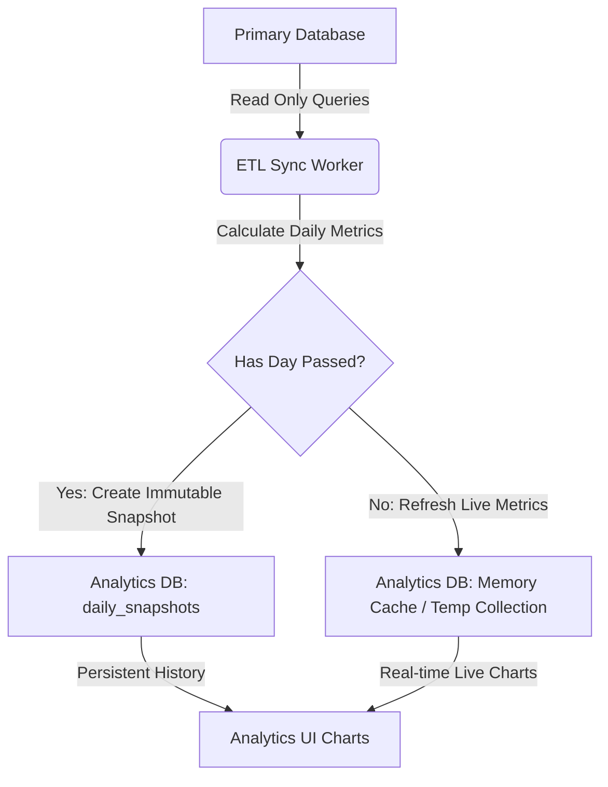

# Analytics Tool Design and Implementation Plan

This document outlines the architecture, database schema, data synchronization mechanism, and UI/UX implementation plan for the **Diligent Analytics Tool**.

---

## 1. Project Overview & Architectural Goals

The Analytics Tool will run as a standalone, decoupled web application. To guarantee that the core transactional system is unaffected:
1. **Zero Write Operations on Core Database:** The analytics tool will only read from the primary database (MongoDB connection read-only replica or query pool).
2. **Dedicated Analytics Database:** Calculations and aggregated metrics will be stored in a separate database instance.
3. **Data Loss Preservation:** Even if historical data (like past bills, payments, or users) is purged or deleted in the primary database, the analytics database will maintain its snapshots, ensuring historical charts remain accurate.
4. **Real-time Live Tracking:** Daily activities (like current operational date bills, collections, and salesman cashouts) must be synced dynamically.

---

## 2. Key Metrics & Areas to Track

The analytics platform will monitor data across three main domains:

### 2.1 Salesman Performance & Ledger Exposure
* **Salesman BF Debt Split:** A point-in-time breakdown of Brought Forward (BF) debt across all active salesmen.
* **Daily Billing vs. Cash Collection Ratio:** Track how much value each salesman bills versus how much physical cash or UPI payment they return.
* **Overdue Exposure Trend:** A historical timeline showing whether the total outstanding debt is growing or shrinking.

### 2.2 Operational Inventory Flow
* **Stock Volume Dispatched:** The sum of billed vs. unbilled loads dispatched daily.
* **Category Billing Distribution:** Track which product categories (e.g., specific cigarette brand categories) represent the highest sales volume.
* **AI Parsing Speed & Accuracy:** Log the percentage of invoice adjustments made manually after AI parsing to track the AI's efficiency over time.

### 2.3 Verification Desk & Billing Speed
* **Verification Latency:** The duration between a salesman submitting a bill or cash entry and the owner approving/verifying it.
* **Submission Counts:** A daily log of total bills submitted, total payments processed, and count of verification actions performed.

---

## 3. Database Architecture & Schema Design (Analytics DB)

The dedicated analytics database will maintain pre-aggregated records to facilitate rapid chart rendering. 

### 3.1 Daily Summary Collection (`daily_snapshots`)
This collection stores the aggregated state of each business day. It will not be modified when old data in the primary database is deleted.
```json
{
  "_id": "ObjectId",
  "operationalDate": "YYYY-MM-DD",
  "totalBillsSubmitted": "Number",
  "totalBillValue": "Number",
  "totalCashCollected": "Number",
  "totalPhonePeCollected": "Number",
  "totalLooseChangeCollected": "Number",
  "billedStockVolume": "Number",
  "unbilledStockVolume": "Number",
  "syncedAt": "Date"
}
```

### 3.2 Salesman Daily Activity Snapshots (`salesman_snapshots`)
Stores individual salesman progress for every calendar day.
```json
{
  "_id": "ObjectId",
  "operationalDate": "YYYY-MM-DD",
  "salesmanId": "ObjectId",
  "salesmanName": "String",
  "salesmanCode": "String",
  "broughtForwardDebtSnap": "Number",
  "submittedBillValue": "Number",
  "submittedPaymentValue": "Number",
  "status": {
    "bill": "String", // "Verified" | "Unverified" | "Missing"
    "cash": "String"  // "Verified" | "Unverified" | "Missing"
  }
}
```

---

## 4. Data Sync Pipeline (ETL Mechanism)

To track live data while protecting historical charts, a dual-phase ETL (Extract, Transform, Load) worker is proposed:



### 4.1 Daily Change Capture
1. **Incremental Cron Job:** A lightweight Node.js/TypeScript script runs every 5 minutes.
2. **Current Day Tracking:** The sync job queries the primary database for the current `systemOperationalDate` (from `AppSettings` or `SystemConfig`). It calculates sums for the current day's active `Bills` and `Payments`.
3. **Upsert Operation:** The worker updates the corresponding `daily_snapshots` and `salesman_snapshots` document for the active operational date.

### 4.2 Immutable Archiving
* **Transition Trigger:** When the system's operational date advances (e.g., when the owner clicks "Advance Date" in the owner dashboard), the ETL worker runs a final consolidation run for the day that just ended.
* **Seal Record:** The final summary document is marked as `sealed: true`. Once sealed, no updates, edits, or deletes in the main database will ever modify this record.
* **Audit Trail:** Even if an owner deletes a user or a bill from 2 months ago in the main app to clean up database space, the `salesman_snapshots` and `daily_snapshots` records for that date remain intact.

---

## 5. UI/UX & Visualization Mockups

To fit the administrative aesthetic, the Analytics UI will utilize modern charting libraries (like Recharts or Chart.js) with clean dark-mode panels and glassmorphism cards.

### 5.1 Bar Chart: Daily Value Submissions
* **Purpose:** Compare bill value vs. payment collected.
* **X-Axis:** Date (YYYY-MM-DD)
* **Y-Axis:** Currency Value (₹)
* **Visuals:** Double-bar layout:
  - Bar 1: Total Bill Value (Indigo Blue fill)
  - Bar 2: Total Cash Collected (Emerald Green fill)

### 5.2 Line/Point-to-Point Graph: Debt Trajectory
* **Purpose:** Monitor whether total exposure is rising.
* **X-Axis:** Chronological timeline (Day 1, Day 2, etc.)
* **Y-Axis:** Total Outstanding Exposure (₹)
* **Visuals:** Single line chart featuring soft gridlines, circular data points, and a subtle red/rose gradient fade under the line.

### 5.3 Pie Chart: Brought Forward (BF) Split
* **Purpose:** Show distribution of debt concentration.
* **Slices:** Salesman names (e.g., "M. Ramesh Rao", "S. Krishna")
* **Values:** Share of total outstanding brought-forward debt.
* **Visuals:** Clean donut chart featuring hover tooltips and dynamic color slices matching the administrative theme.

---

## 6. Implementation Milestones

1. **Phase 1: Pipeline Setup**
   - Create new Node.js server container.
   - Establish secondary read-only MongoDB connection string to the primary database.
   - Connect to the new Analytics database.
2. **Phase 2: Cron Integration**
   - Write the daily calculator functions.
   - Set up the cron triggers to poll current-day data and upsert snapshots.
3. **Phase 3: Front-end Build**
   - Initialize a new React Vite project.
   - Install visual libraries (`recharts`, `lucide-react`).
   - Create responsive dashboard pages showing the snapshots.
